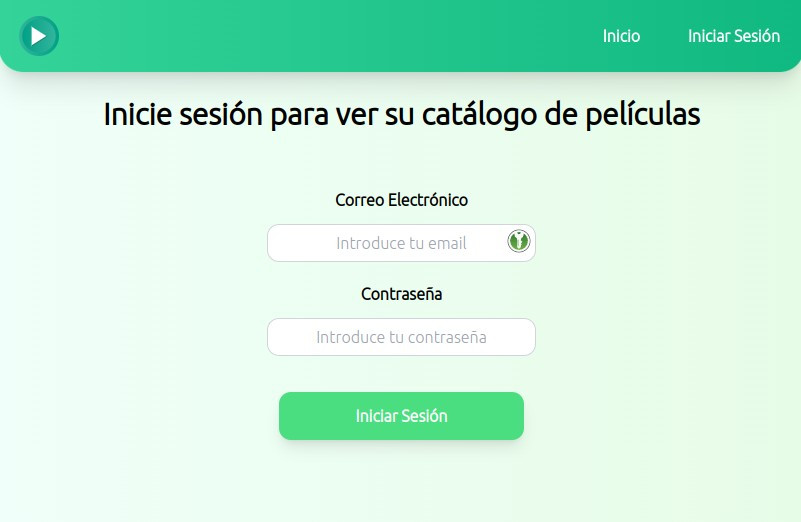

# This project is just an hobby

## Images:




## Project setup
```
npm install
```

### Compiles and hot-reloads for development
```
npm run serve
```

### Compiles and minifies for production
```
npm run build
```

### Create config.json into src with this code:
```
{
    "THEMOVIEDB_API_KEY": "The themoviedb API key",
    "BASE_URL_THEMOVIEDB": "https://api.themoviedb.org/3/",
    "BASE_URL_BACKEND": "http://127.0.0.1"
}
```
